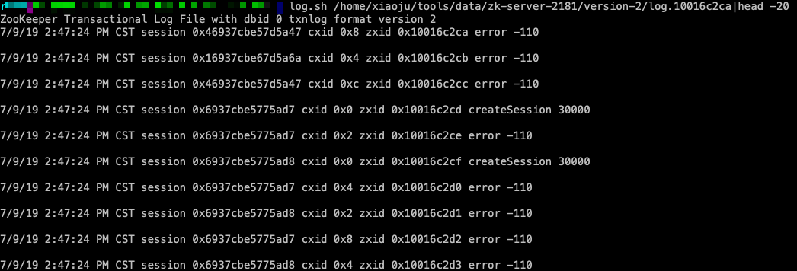
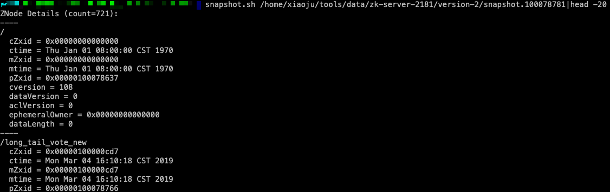

# zk-ops-tools
ops tools for zookeeper

### dump zookeeper data to file
```
./backup -host 1.1.1.1 -port 2181 -dir ./backup/
```

### restore data to zookeeper from backup file
```
./restore -backupFile ./backup/20170704-0945.txt -host 2.2.2.2 -port 2181
```

### parse log file
```
log.sh /home/xiaoju/tools/data/zk-server-2181/version-2/log.10016c2ca
```


### parse snapshot file
```
snapshot.sh /home/xiaoju/tools/data/zk-server-2181/version-2/snapshot.100078781
```
